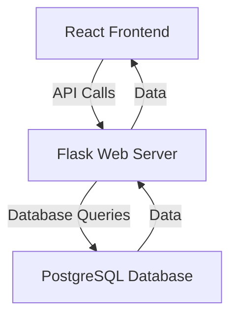
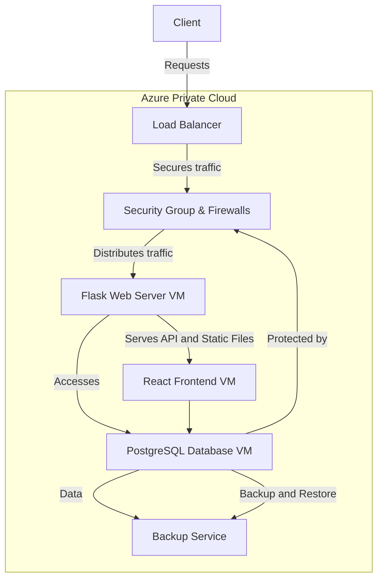
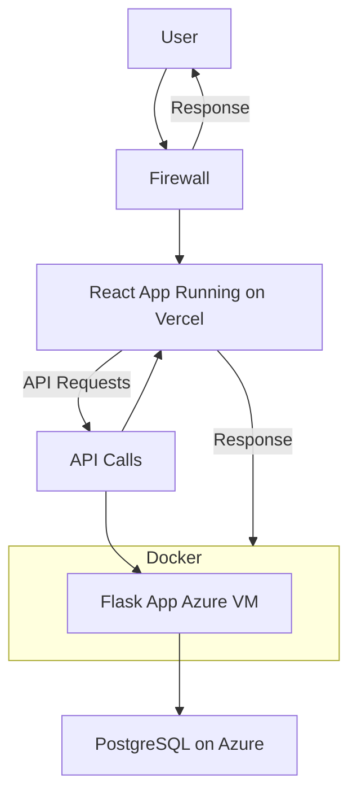

# On premise deployment

The Mermaid diagram represents a web application architecture with three main components: React Frontend, Flask Web Server, and PostgreSQL Database. In this diagram, the React Frontend sends API calls to the Flask Web Server to request data. The Flask server processes these requests and interacts with the PostgreSQL Database through database queries to fetch or update data. The database returns the data to the Flask server, which then sends it back to the React frontend. This flow illustrates the interaction between the client-side and server-side components, emphasizing how they communicate and exchange data in the application.

# IaaS deployment architecture

The below  Mermaid diagram outlines a web application architecture that includes a client interface, a load balancer, security measures, a Flask web server, a React frontend, a PostgreSQL database, and a backup service, all hosted within an Azure Private Cloud. Clients initiate requests to the load balancer, which secures and distributes the traffic to the Flask web server. This server handles API requests and serves static files while accessing the PostgreSQL database for data management. The React frontend interacts with the Flask server to present information to users and can also query the database directly. Additionally, the PostgreSQL database is connected to a backup service to ensure data protection and recovery. Overall, this structure emphasizes both functionality and security, ensuring a robust web application environment.

# Deployment using PaaS

The Mermaid diagram depicts a web application architecture in an Azure Private Cloud. It features a Client that sends requests to a Load Balancer, which secures and distributes traffic to a Flask Web Server. The server handles API requests and interacts with a PostgreSQL Database. The React Frontend communicates with both the Flask server and the database. Security is enforced through Firewalls, and a Backup Service ensures data protection. This setup emphasizes robust functionality and security for the application.
